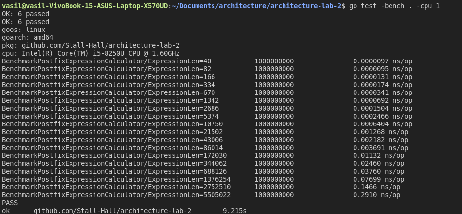
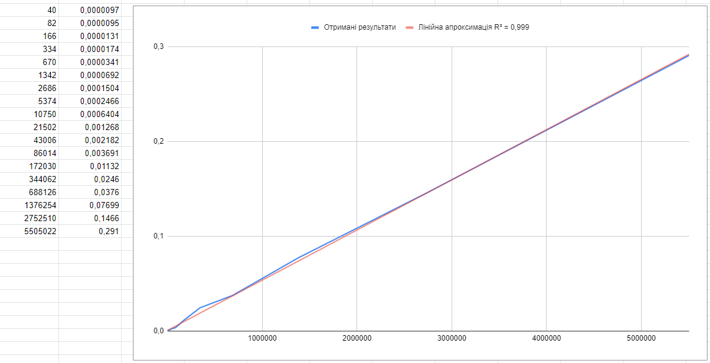
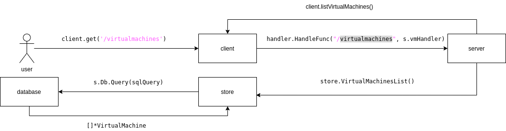
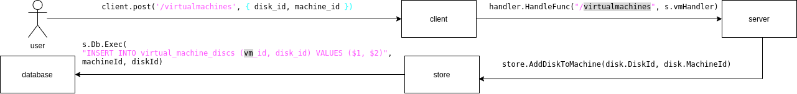
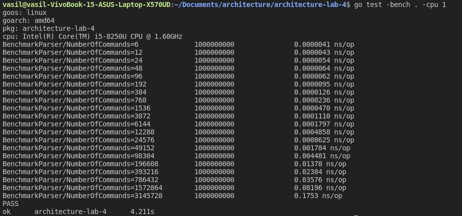
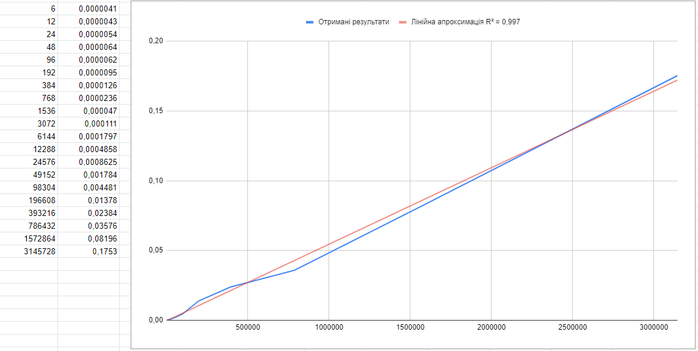
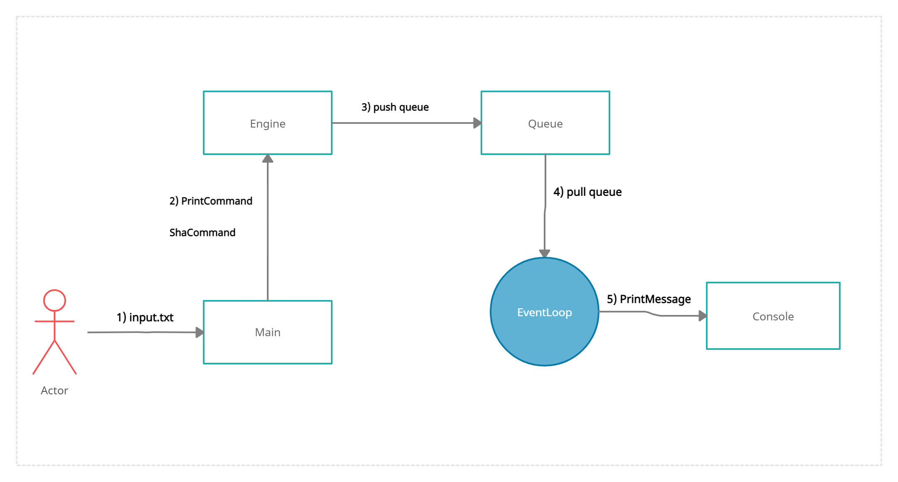

# Архітектура програмного забезпечення

## Розрахункова-графічна робота

### **Тема**: Архітектурні діаграми та бенчмарки

### **Мета**: Закріплення навичок ілюстрації організації програмних систем та оцінки часу виконання алгоритмів

### Виконали студенти групи ІП-93:
- Синишин Василь
- Суханова Марія
- Мусій Іван

### Зміст

- [Завдання](#Завдання)
- [1 завдання](#1-завдання)
- [2 завдання](#2-завдання)
- [3 завдання](#3-завдання)

### Завдання

- Для 2-гої роботи, підтвердьте лінійний час виконання вашої функції перетворення чи обчислення вхідного виразу

- Для 3-тої роботи, побудуйте діаграму взаємодії компонентів у вашій імплементації

- Для 4-ої роботи, побудуйте діаграму взаємодії для вашої реалізації (на ній, скоріш за все, мають опинитися компоненти парсера, черги команд, ядра цикла) та підтвердьте лінійний час роботи вашого парсера команд

## 1 завдання
Варіант: Обчислити постфіксний вираз

Для того, щоб підтвердити лінійний час виконання функції PostfixExpressionCalculator, було підготовлено бенчмарк:

```go
package lab2

import (
	"fmt"
	"testing"
)

var calcResult float64

func BenchmarkPostfixExpressionCalculator(b *testing.B) {
	const baseExp = "2 3 ^ 10 5 / - 2 + "
	currentExpression := baseExp
	for i := 0; i < 18; i++ {
		currentExpression += currentExpression + "+ "
		b.Run(fmt.Sprintf("ExpressionLen=%d", len(currentExpression)), func(b *testing.B) {
			calcResult, _ = PostfixExpressionCalculator(currentExpression)
		})
	}
}
```

Вивід в консоль:


В результаті ми отримали 18 точок для подальшої візуальзації.

Графік:

Дивлячись на графік можна побачити, що лінія отриманих результатів знаходиться досить близько до лінії лінійного наближення. Отже, можна сказати, що дана функція має лінійний час виконання.

## 2 завдання



1. Користувач може використати метод GET  за адресою /virtualmachines
2. Далі спрацьовує handler.HandlerFunc
3. Далі сервер використовує store.VirtualMachinesList щоб звернутися до store
4. Далі store надсилає запит до database щоб отримати всі віртуальні машини.




1. Користувач може використати метод POST  за адресою /virtualmachines
2. Далі спрацьовує handler.HandlerFunc
3. Далі сервер використовує store.AddDiskToMachine щоб звернутися до store
4. Далі store надсилає запит до database щоб змінити дані в базі.

## 3 завдання
Для того, щоб підтвердити лінійний час роботи парсера команд, було підготовлено даний бенчмарк:

```go
package benchmark

import (
	"fmt"
	"strings"
	"testing"
	"architecture-lab-4/parser"
)

func BenchmarkParser(b *testing.B) {
	baseInputCommands := "print sdas\nsha1 234\nprint 233\n"
	currentInputCommands := baseInputCommands
	for i := 0; i < 20; i++ {
		currentInputCommands += currentInputCommands
		b.Run(fmt.Sprintf("NumberOfCommands=%d", strings.Count(currentInputCommands, "\n")), func(b *testing.B) {
			_ = parser.Parse(currentInputCommands)
		})
	}
}
```

Вивід в консоль:


В результаті виконання цього бенчмарк, було отримано 20 точок для візуальзації.

Графік:

Можна побачити, що лінії отриманих результатів та лінії лінійного наближення знаходиться досить близько одна біля одної. Отже, можна сказати, що дана парсер команд має лінійний час виконання.

Діаграмма взаємодії:


Опис діаграми:

1. Від користувача у main надходить текстовий файл, який там парситься.
2. Після цього, з main відправляється відповідна команда в Engine. 
3. Engine пушить її у чергу.
4. EventLoop дістає відповідну команду з черги. 
5. EventLoop виводить команду у консоль.
